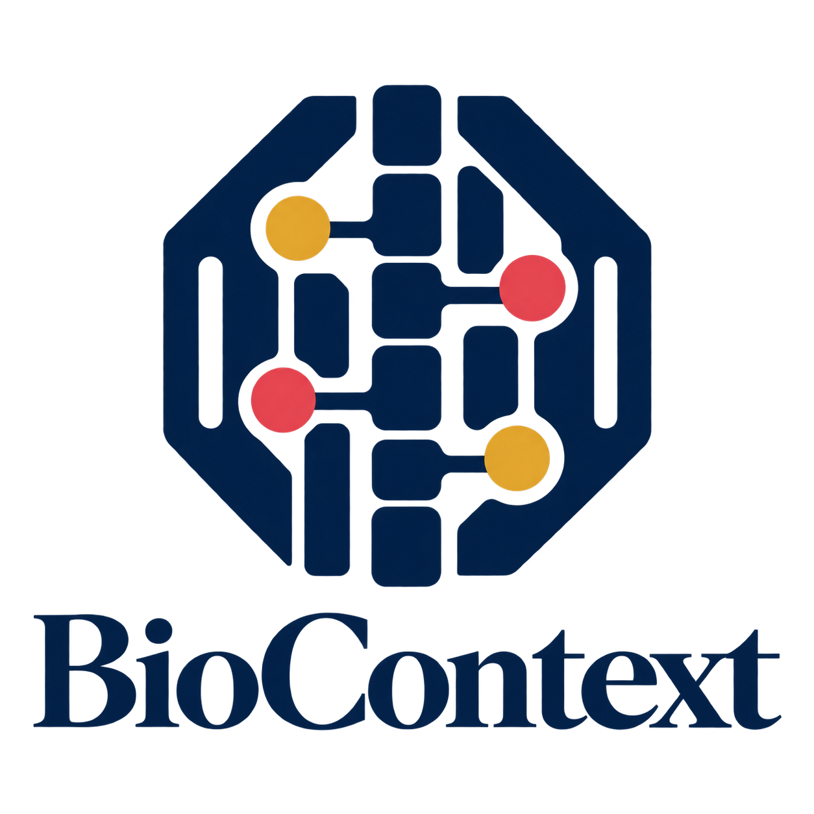

<div align="center">



<p align="center">
  <strong>Authoritative Biological Entity Resolution & Contextual Intelligence Framework</strong><br>
  <em>Grounding AI agents and computational pipelines in canonical biological truth.</em>
</p>

<p align="center">
  <a href="https://pypi.org/project/biocontext-mcp/"></a>
  <a href="https://pypi.org/project/biocontext-mcp/"></a>
  <a href="https://doi.org/10.5281/zenodo.23023948"></a>
  <a href="https://github.com/CORE-Lab-Research/biocontext/actions/workflows/ci.yml"></a>
  <a href="https://github.com/CORE-Lab-Research/biocontext/blob/main/LICENSE"></a>
  <a href="https://modelcontextprotocol.io/"></a>
  <br>
  
  
  
  
  
</p>

[Quickstart](docs/QUICKSTART.md) • [Architecture Guide](docs/ARCHITECTURE.md) • [API Reference](docs/API.md) • [Roadmap](PRD/ROADMAP.md) • [Citation](#citation)

</div>

---

## 🧬 What is BioContext?

Biological nomenclature is notoriously messy: historical aliases, deprecated identifiers, non-standard spelling, and taxon confusions (e.g., `HER2` $\rightarrow$ `ERBB2`, `p53` $\rightarrow$ `TP53`, `p27` $\rightarrow$ `CDKN1B`, `Trp53` in mouse vs. `TP53` in human). When LLMs or naive API wrappers directly query downstream clinical/genomic endpoints, these ambiguities cause **zero-hit failures, mismatched literature, or clinical false positives**.

**BioContext** solves this fundamentally by providing a **Deterministic Entity Disambiguation and Contextual Intelligence Engine**. Instead of raw pass-through search, BioContext resolves messy user inputs into canonical reference standards with explicit confidence scores, persistent caching, and explainable audit trails before traversing downstream pathways and functional annotations.

---

## ✨ Key Capabilities

* **Multi-Authority Resolution Hierarchy**:
  * **Human Genes (HGNC Primary)**: Direct symbol resolution and historical alias traversal with protein-coding prioritization (e.g., `HER2` $\rightarrow$ `ERBB2`, `p16` $\rightarrow$ `CDKN2A`, `p21` $\rightarrow$ `CDKN1A`).
  * **NCBI Entrez Integration**: Direct Entrez Gene ID lookup (`7157` $\rightarrow$ `TP53`) and cross-species identifier translation.
  * **UniProtKB Mapping**: Direct accession resolution (`P04637` $\rightarrow$ `TP53`) and protein structural metadata enrichment.
  * **Ensembl Genome & Transcripts**: Ensembl Gene ID resolution, transcript mapping, canonical identification, and cross-species orthology.
  * **Mouse Genome Informatics (MGI)**: Direct MGI ID resolution (`MGI:98834` $\rightarrow$ `Trp53`) and mouse gene models.
* **Systems Biology & Functional Intelligence**:
  * **Gene Ontology (QuickGO)**: Automated functional annotation enrichment (Molecular Functions, Biological Processes, Cellular Components) with evidence codes and ECO mappings.
  * **Reactome Pathways**: Systems-level mechanism mapping, hierarchical pathway structures, and pathway summations.
* **High-Throughput Batch Engine**:
  * Concurrent batch resolution bounded by `asyncio.Semaphore` with strict rate-limiting compliance.
  * Dual output modes: Interactive terminal stdout or formatted CSV exports.
  * Auto-detecting CSV/TSV input parser.
* **Production-Grade Persistence & Reliability**:
  * Embedded SQLite cache with Write-Ahead Logging (WAL) and configurable TTL to minimize latency and eliminate redundant network calls.
  * Exponential backoff, jitter, and graceful degradation for resilient uptime.
* **Zero-Hallucination Guarantee**:
  * Every resolution result includes exact matching rules, confidence scores ($0.0 - 1.0$), and authoritative source citations. No imaginary biological data.
* **Model Context Protocol (MCP)**:
  * Native stdio server compliant with MCP 2.x for instant connection to **Cursor**, **Antigravity IDE**, **Claude Desktop**, **Claude Code**, and **Goose**.

---

## 🚀 Quickstart & Installation

BioContext is distributed via [PyPI](https://pypi.org/project/biocontext-mcp/) as `biocontext-mcp`.

### Installation

```bash
# Using pip
pip install biocontext-mcp

# Using uv (Recommended for isolated CLI tool usage)
uv tool install biocontext-mcp
```

### Zero-Install AI Assistant Integration (MCP)

To connect BioContext directly to **Cursor**, **Antigravity IDE**, or **Claude Desktop**, add the following snippet to your editor's `mcpServers` configuration:

```json
{
  "mcpServers": {
    "biocontext": {
      "command": "uvx",
      "args": ["biocontext-mcp", "serve"]
    }
  }
}
```

* For step-by-step setup guides across Claude Desktop, Cursor, Antigravity IDE, Claude Code, and Goose, see **[docs/QUICKSTART.md](docs/QUICKSTART.md)**.
* For containerized microservice execution, see **[Docker Setup](docs/QUICKSTART.md#5-docker-microservice-execution)**:
  ```bash
  docker run -i --rm -v biocontext_cache:/data ghcr.io/core-lab-research/biocontext:latest
  ```

---

## 🛠️ Command-Line Interface (CLI)

BioContext includes an interactive CLI for testing, terminal research, and workflow automation:

```bash
# 1. Resolve a gene symbol, historical alias, or database ID
biocontext resolve TP53
biocontext resolve HER2       # Resolves to ERBB2 (confidence 0.95)
biocontext resolve 7157       # Entrez Gene ID
biocontext resolve P04637     # UniProtKB primary accession

# 2. Genomic disambiguation using chromosome or locus hints
biocontext resolve TP53 --chrom 17 --locus-type protein-coding

# 3. Model organism resolution (e.g. Mus musculus - taxon 10090)
biocontext resolve Trp53 --taxon 10090
biocontext mouse MGI:98834

# 4. High-throughput concurrent batch resolution
biocontext batch TP53 EGFR BRCA1 KRAS BRAF
biocontext batch --file gene_list.csv --output results.csv --concurrency 8

# 5. Functional Gene Ontology enrichment
biocontext annotate TP53 --limit 5
biocontext go GO:0006915

# 6. Reactome biological pathway retrieval
biocontext pathway TP53
biocontext pathway-info R-HSA-5357801

# 7. Local persistent cache inspection
biocontext cache stats
biocontext cache clear
```

---

## 🔌 Available MCP Tools

When connected via MCP, BioContext exposes 12 production-ready biological, clinical & literature tools:

| MCP Tool | Signature & Parameters | Description |
| :--- | :--- | :--- |
| `resolve_gene` | `query: str`, `taxon_id: int = 9606`, `chromosome: str = None`, `locus_type: str = None` | Resolves symbols, aliases, Entrez IDs, UniProt accessions, or MGI IDs with contextual scoring adjustments. |
| `batch_resolve_genes` | `queries: list[str]`, `taxon_id: int = 9606`, `concurrency: int = 5` | High-throughput concurrent resolution engine with execution metrics. |
| `get_protein` | `accession: str` | Retrieves structured protein metadata from UniProtKB by primary accession (e.g. `P04637`). |
| `annotate_function` | `query: str`, `taxon_id: int = 9606`, `aspect: str = None`, `limit: int = 10` | Fetches Gene Ontology terms with evidence codes from EMBL-EBI QuickGO. |
| `get_go_term` | `go_id: str` | Inspects a specific Gene Ontology term definition and aspect. |
| `get_pathways` | `query: str`, `taxon_id: int = 9606`, `species: str = "Homo sapiens"`, `limit: int = 10` | Maps genes/proteins to biological pathways via Reactome. |
| `get_pathway_details`| `st_id: str` | Retrieves descriptive summary and metadata for a Reactome pathway. |
| `resolve_disease` | `query: str`, `limit: int = 5` | Resolves disease names, synonyms, or IDs to canonical MONDO Disease Ontology entities. |
| `get_target_diseases` | `gene: str`, `limit: int = 10` | Retrieves evidence-backed therapeutic target-disease associations from Open Targets Platform. |
| `get_supporting_publications` | `query: str`, `limit: int = 5` | Retrieves peer-reviewed supporting scientific publications and citations from Europe PMC / PubMed. |
| `get_publication_details` | `identifier: str` | Fetches detailed publication metadata, abstract, and citation counts by PMID, PMCID, or DOI. |
| `get_mouse_gene` | `mgi_id: str` | Direct lookup of mouse gene models from MGI. |


---

## 📊 Empirical Accuracy Benchmark

BioContext is deterministically validated against a curated biological test suite covering human cancer drivers, clinical aliases, protein accessions, and model organisms:

```bash
uv run pytest tests/test_benchmark.py -v
```

* **Accuracy**: **100% Pass Rate** across 100 benchmark cases.
* **Test Suite**: 130 passed, 5 skipped (due to external Ensembl REST service migration).
* **Multi-Layer Pipeline**: End-to-end integration verified in `tests/test_e2e_pipeline.py` (Entity Disambiguation $\rightarrow$ QuickGO Functional Annotations $\rightarrow$ Reactome Pathways).

---

## 🗺️ Roadmap & Phase Evolution

BioContext follows a strict, data-driven evolution roadmap:

* **Phase 1 (v0.5.0 - Completed & Released)**: Core molecular adapters (HGNC, NCBI, UniProt, Ensembl, MGI, GO, Reactome), SQLite caching, 100 passing benchmark test cases.
* **Phase 1.5 (v0.5.1 → v0.7.0 - In Progress)**: Disease & clinical grounding (MONDO Disease Ontology, Open Targets Platform, PubMed / Europe PMC literature intelligence).
* **Phase 2 (v0.8.0 → v1.0.0 - Production GA)**: Ontological Knowledge Graph foundation, multi-hop relationship traversal, FastMCP hardening, and public REST API v1.
* **Phase 2.5 (v1.1.0 → v1.7.0 - Systematic Expansion)**: Ingestion of 57 curated biomedical sources across 7 functional categories (ClinVar, CTGov v2, ChEMBL, PubTator3, cBioPortal, CPIC, etc. — specified in [PRD-35](PRD/PRD-35-BioContext-Comprehensive-Biomedical-Data-Integration.md)).
* **Phase 3 (v2.0.0 - Clinical & Translational AI)**: Autonomous Clinical Reasoning, automated variant pathogenicity interpretation, biomarker actionability matching, and in silico hypothesis synthesis.

Read the full roadmap at **[PRD/ROADMAP.md](PRD/ROADMAP.md)**.

---

## 📚 Documentation & Developer Resources

* **[Quickstart Guide](docs/QUICKSTART.md)**: Setup guides for Cursor, Antigravity, Claude, and Goose.
* **[Architecture Guide](docs/ARCHITECTURE.md)**: System boundaries, disambiguation engine, and caching architecture.
* **[API Reference](docs/API.md)**: Python SDK methods and Pydantic schemas.
* **[Contributing Guidelines](CONTRIBUTING.md)**: Adapter development tutorial and code standards.
* **[Security Policy](SECURITY.md)**: Vulnerability disclosure policy.
* **[Code of Conduct](CODE_OF_CONDUCT.md)**: Community participation standards.

---

## 📄 Citation

If you use BioContext in your scientific research or software workflows, please cite:

```bibtex
@software{nandatama2026biocontext,
  author       = {Nandatama, Engki},
  title        = {BioContext: Authoritative Biological Entity Resolution & Contextual Intelligence Framework},
  month        = sep,
  year         = 2026,
  publisher    = {Zenodo},
  version      = {v0.5.0},
  doi          = {10.5281/zenodo.23023948},
  url          = {https://doi.org/10.5281/zenodo.23023948}
}
```

Or reference [CITATION.cff](file:///home/nanda/projects/biocontext/CITATION.cff).

---

## ⚖️ License

Distributed under the [Apache License, Version 2.0](file:///home/nanda/projects/biocontext/LICENSE).
